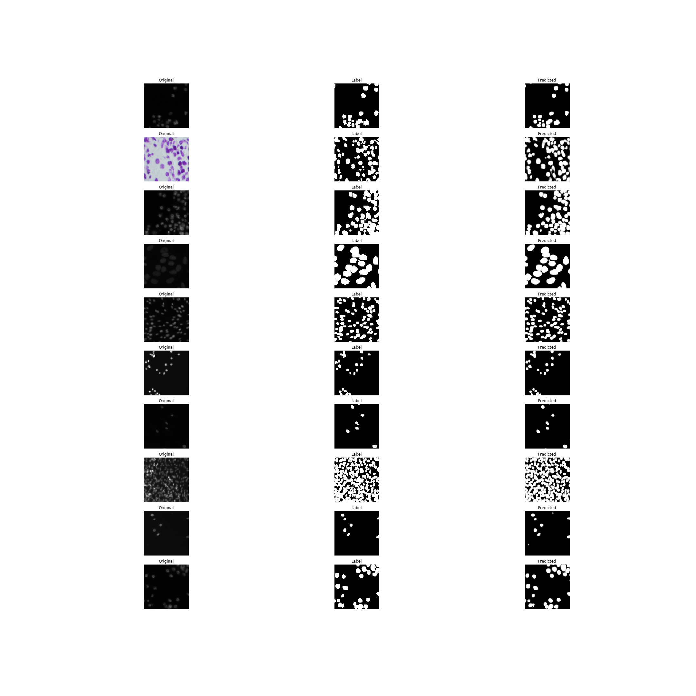

# A UNet implementation in Keras Nuclei Segmentation

This repository contains implementation of UNet for Nuclei segmentation in data science bowl 2018 challenge. The implementation is in keras.

## Model Architecture

## Results

